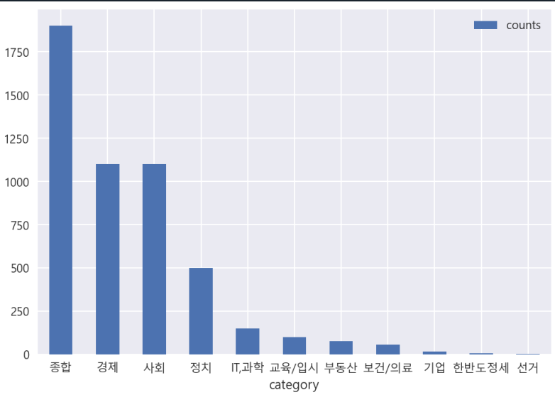

문서 요약 및 핵심 주제 추출
===================

- BERTopic 학습
    - 뉴스 5000개 문서로 BERTopic 학습

    

- Extractive 요약
    - AIHub의 문서요약 "사설" 문서 데이터 검증 5000개 

토큰화 중 조사, 접속사 분리 후              
    
토큰화 중 명사, 동사, 형용사 사용          

